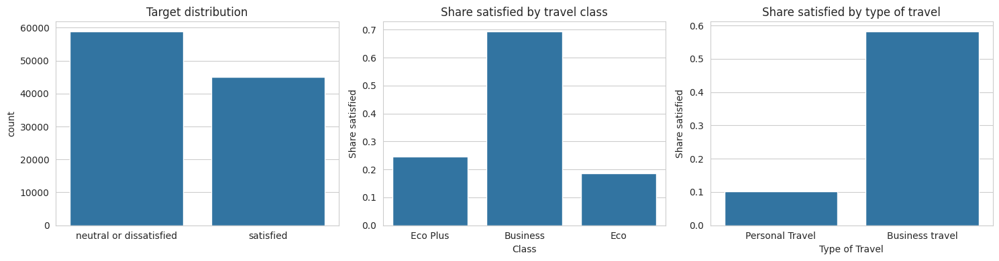
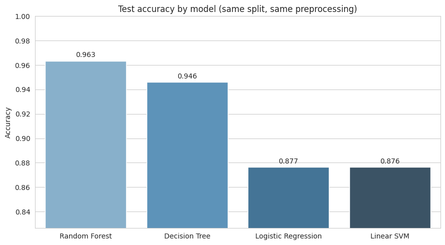
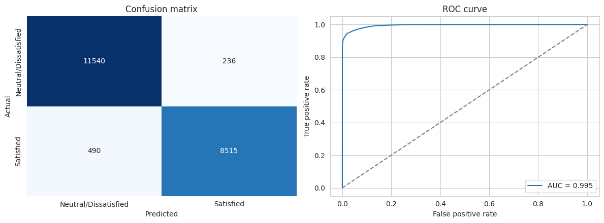
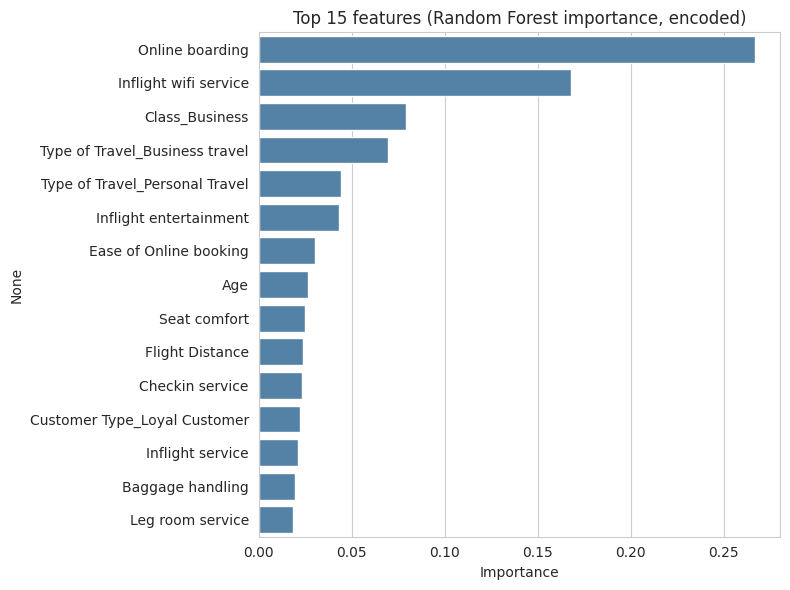
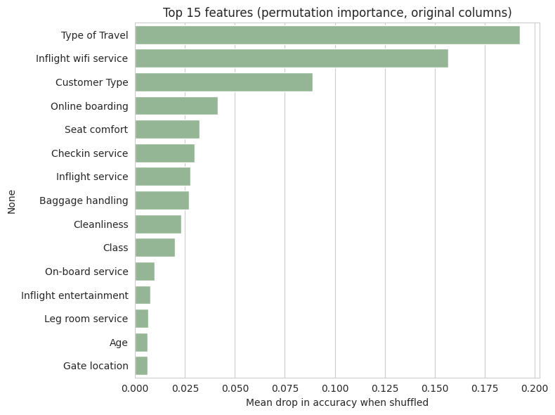

# Airline Passenger Satisfaction Prediction

A classification project that predicts whether an airline passenger was satisfied or neutral/dissatisfied after a flight, using their profile, trip details, and in-flight service ratings.

I built this as part of my MSc Data Science studies. The project covers the full workflow in one notebook: cleaning, a leak-free preprocessing pipeline, a fair model comparison, hyperparameter tuning, model interpretation, and clear business-facing results.

## Dataset

Airline Passenger Satisfaction survey data from Kaggle: https://www.kaggle.com/datasets/teejmahal20/airline-passenger-satisfaction (I used `train.csv`).

| Field | Value |
|---|---|
| Rows | 103,904 |
| Columns | 25 (22 used as features after dropping `Unnamed: 0`, `id`, and the target) |
| Target | `satisfaction`: 58,879 neutral/dissatisfied (56.7%), 45,025 satisfied (43.3%) |
| Passenger info | Gender, Customer Type, Age |
| Trip info | Type of Travel, Class, Flight Distance, Departure Delay, Arrival Delay |
| Service ratings | 14 columns scored 0 to 5 (wifi, online boarding, seat comfort, cleanliness, baggage handling, etc.) |

Only `Arrival Delay in Minutes` has missing values (310 rows, about 0.3%).

## Approach

1. Cleaning: dropped `Unnamed: 0` and `id`, since neither describes the passenger or the flight. Encoded the target as `1` for satisfied and `0` otherwise.
2. EDA: checked class balance and how satisfaction changes by travel class and type of travel.
3. Preprocessing pipeline: median imputation and standard scaling for numeric columns, most-frequent imputation and one-hot encoding for categorical ones. All preprocessing is inside a scikit-learn pipeline.
4. Split: 80/20 stratified train/test split (83,123 training rows, 20,781 test rows), `random_state=42`.
5. Model comparison: Logistic Regression, Linear SVM, Decision Tree, and Random Forest, all on the same split and same preprocessing pipeline.
6. Tuning: `RandomizedSearchCV` on the Random Forest using the training set only. The test set was used once for final evaluation.
7. Interpretation: feature importance and permutation importance on the test set.

## EDA



Satisfaction differs a lot by group. Business class passengers are far more likely to be satisfied (roughly 69%) than Eco Plus (about 25%) or Eco (about 19%). The gap is just as large for type of travel: business passengers are much more satisfied than personal travelers.

## Results

### Model comparison

| Model | Test accuracy |
|---|---|
| Random Forest (baseline) | 0.963 |
| Decision Tree | 0.946 |
| Logistic Regression | 0.877 |
| Linear SVM | 0.876 |



The tree-based models clearly outperform the linear ones. That suggests the relationship between the features and satisfaction is not linear. For example, the effect of a rating may depend on other attributes such as class, travel type, or customer status.

### Final model (tuned Random Forest)

| Metric | Value |
|---|---|
| Test accuracy | 96.51% |
| ROC-AUC | 0.9948 |

| Class | Precision | Recall | F1 | Support |
|---|---|---|---|---|
| Neutral/Dissatisfied | 0.959 | 0.980 | 0.970 | 11,776 |
| Satisfied | 0.973 | 0.946 | 0.959 | 9,005 |

Tuning improved the Random Forest from 0.963 to 0.965 on the test set, confirming that most of the performance comes from the model choice and the data rather than the search itself.



Out of 20,781 test passengers, the model made 726 mistakes: 236 dissatisfied passengers were predicted as satisfied and 490 satisfied passengers were predicted as dissatisfied. It misses slightly more satisfied passengers than dissatisfied ones, which is common when the model tries to balance recall and precision.

## What drives satisfaction

I looked at feature importance in two ways, because they answer slightly different questions.

**Random Forest importance** (on encoded features, so `Type of Travel` is split into separate one-hot columns):



**Permutation importance** (on the test set, grouped by original column, measured as the drop in accuracy when a column is shuffled):



The two views disagree in ordering, and that is useful to understand:

- In the Random Forest chart, **Online boarding** and **Inflight wifi service** come first. `Type of Travel` appears smaller there because its importance is split across separate one-hot columns.
- In the permutation chart, where those columns are grouped, **Type of Travel** is the single most important feature, followed by **Inflight wifi service**, **Customer Type**, and **Online boarding**.
- Taken together, the trip context (why the passenger is flying and what kind of customer they are) and a few service experiences (wifi, online boarding, seat comfort) matter most.

## Example prediction

The pipeline accepts raw columns, so a new passenger can be scored directly. A loyal business-class passenger on a business trip, with high ratings for wifi, boarding, and entertainment and no delays, would likely be predicted as satisfied.

```text
Prediction: Satisfied  (P(satisfied) = 0.77)
```

## Limitations

- The service ratings are collected after the flight. The model therefore explains satisfaction after the fact; it cannot predict satisfaction before travel.
- A rating of `0` means “not applicable” in this dataset, but it was treated as an ordinary number.
- The results come from one train/test split on one survey dataset. The cross-validation runs suggest stability, but I have not tested the model on other airlines or other time periods.
- Feature importance shows association, not cause. Type of Travel, Class, and Customer Type are related to each other, which can shift importance between them.

## Repository structure

```text
.
├── airline_passenger_satisfaction.ipynb
├── requirements.txt
├── README.md
├── images/
└── train.csv
```

## How to run

1. Clone the repo and install the dependencies:

```bash
pip install -r requirements.txt
```

2. Download `train.csv` from the Kaggle link above and place it in the repository root.
3. Open `airline_passenger_satisfaction.ipynb` in Jupyter or Colab and run all cells.

If you use Google Colab, update the file path in the loading cell to match your local or Drive location.

## Tools

Python, Pandas, NumPy, Matplotlib, Seaborn, Scikit-learn

## Possible next steps

- Try gradient boosting models such as XGBoost or LightGBM and compare them with the Random Forest.
- Adjust the decision threshold to trade precision against recall, depending on airline priorities.
- Add SHAP values for explanations of individual predictions.
- Save the trained pipeline with `joblib` and wrap it in a small Streamlit app.

## Author

Kaushik, MSc Data Science student.
